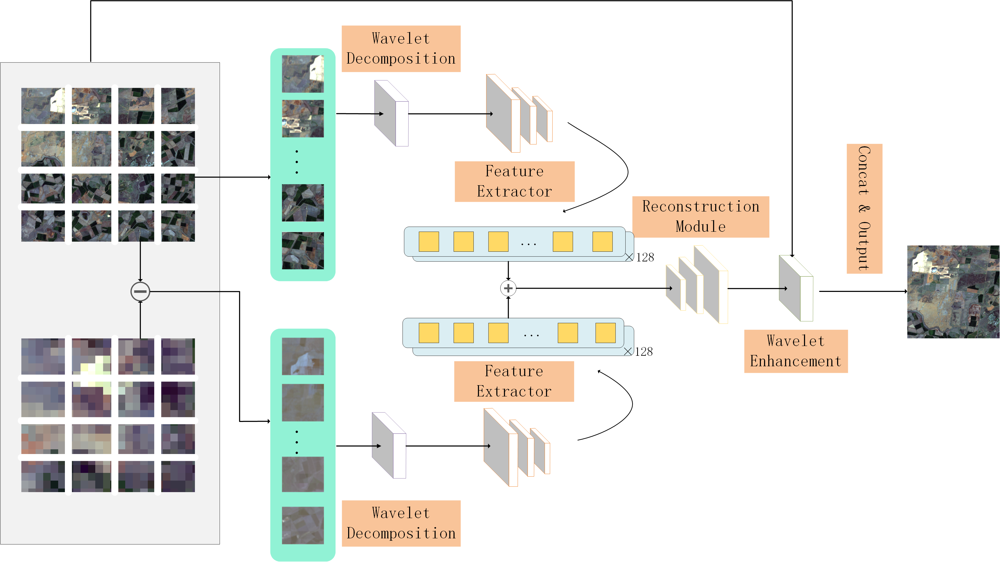

# EWMT: Enhanced Wavelet Multi-head Transformer for Frequency-Decoupled Two-Input Spatiotemporal Fusion

This repository contains the official implementation of **EWMT**, a deep learning model for **two-input spatiotemporal fusion** of remote sensing images. The model addresses the trade-off between spatial and temporal resolution by integrating **frequency decoupling** into both the network architecture and the optimization objective.

## 📖 Abstract

High spatiotemporal resolution remote sensing imagery is essential for monitoring dynamic Earth surface processes. However, practical **two-input approaches**—relying solely on a prior reference and a current low-resolution observation—often struggle to balance the recovery of high-frequency details with the preservation of spectral consistency.

**EWMT** mitigates this issue by identifying **frequency coupling** as the primary bottleneck. The proposed method features:

* **End-to-End Frequency Decoupling:** A learnable two-level wavelet front-end performs subband filtering.
* **SWAR Refinement:** A reference-guided local sliding-window attention module refines the preliminary fusion result by conditioning on the reference image.
* **Decoupled Supervision:** A two-level Haar wavelet loss separately constrains low- and high-frequency subbands.

Experimental results on CIA, LGC, and SW datasets demonstrate that EWMT significantly outperforms state-of-the-art two-input baselines and achieves performance competitive with complex three-input models, making it ideal for resource-constrained deployment.

## 🏗️ Architecture

### Overall Framework

The model consists of a two-stage pipeline: **Preliminary Fusion** and **SWAR Refinement**.


### Key Modules

#### 1. Learnable Wavelet Front-End

A two-level wavelet decomposition separates features into frequency subbands for processed encoding.


#### 2. SWAR (Swin-based Window Attention Refinement)

A reference-guided module that refines details using window-based self-attention.


## 📂 Project Structure

* **`model_EWMT.py`**: Implementation of the **FusionNet_2** architecture, including `RFEncoder` (SwinResidualRFBlock) and Wavelet Transform modules.
* **`run.py`**: The **main entry point** for training and testing the model. Handles argument parsing and experiment setup.
* **`experiment.py`**: Contains the `Experiment` class, managing the training loop, validation, and testing procedures.
* **`evaluate.py`**: Script for calculating quantitative metrics (RMSE, SSIM, SAM, ERGAS, etc.) on the test results.
* **`utils.py`**, **`ssim.py`**, **`wavelet.py`**, **`wt_conv.py`**: Utility functions and helper modules for loss calculation and wavelet operations.
* **`data_cia.py`**: (Expected) Dataset loader for the CIA dataset format.

## 🚀 Usage

### Requirements

* Python 3.x
* PyTorch (CUDA recommended)
* Rasterio
* NumPy
* Pandas
* Scikit-image

### Training

To train the model, use `run.py`. You can configure hyperparameters via command-line arguments.

```bash
python run.py --train_dir /path/to/train --val_dir /path/to/val --save_dir ./out --epochs 50 --batch_size 8 --lr 0.001
```

**Common Arguments:**

* `--train_dir`: Path to training data.
* `--val_dir`: Path to validation data.
* `--save_dir`: Directory to save checkpoints and logs.
* `--epochs`: Number of training epochs (default: 50).
* `--batch_size`: Batch size (default: 8).
* `--lr`: Learning rate (default: 1e-3).
* `--cuda`: Enable CUDA (default: True).

### Evaluation

After generating predictions, use `evaluate.py` to compute metrics.

**Note:** Ensure you update the `test_folder` path in `evaluate.py` to point to your output directory before running.

```bash
python evaluate.py
```

## 📊 Results & Contributions

EWMT achieves a superior trade-off between performance and efficiency, reducing parameter count and latency while maintaining reconstruction quality competitive with three-input models. It is particularly effective for scenarios where future reference images are unavailable (cloud cover or real-time monitoring).
