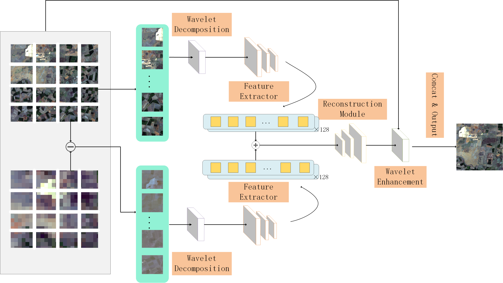

# EWMT: Frequency-Decoupled Two-Input Spatiotemporal Fusion

[](https://opensource.org/licenses/MIT)
[](https://pytorch.org/)

This repository contains the official PyTorch implementation of the paper:

**EWMT: Frequency-Decoupled Two-Input Spatiotemporal Fusion with Wavelet Front-End and Reference-Guided Local Attention**

*Accepted/Submitted to IEEE Journal of Selected Topics in Applied Earth Observations and Remote Sensing (JSTARS)*

**Authors:** Tongquan Wu, Weiquan Kong, Yuanxu Wang, Lu Bai, and Yurong Qian* (Xinjiang University)

---

## 📖 Abstract

Two-input spatiotemporal fusion often suffers from a trade-off between recovering high-frequency details and preserving spectral consistency. We propose **EWMT**, a frequency-decoupled network that addresses this issue through:

1.  **Wavelet Front-End (`WTConv2d`):** A learnable two-level wavelet decomposition module that separates high-frequency textures from low-frequency structures.
2.  **Decoupled Supervision:** A two-level Haar wavelet loss combined with MS-SSIM.
3.  **SWAR Refinement:** A Reference-Guided Sliding-Window Attention module for efficient detail recovery.

Experiments on CIA, LGC, and SW datasets show that EWMT achieves competitive performance against state-of-the-art three-input models while using significantly fewer parameters and lower latency.

## 🏗️ Architecture

*(Please upload your framework figure to a `fig/` folder and name it `framework.png`)*


## 🛠️ Requirements

- Python 3.8+
- PyTorch 1.12+
- CUDA 11.3+
- PyWavelets (`pywt`)

Install dependencies:

```bash
pip install -r requirements.txt
```

## 📂 Dataset Preparation

We evaluated our model on three public datasets:
- **CIA (Coleambally Irrigation Area)**
- **LGC (Lower Gwydir Catchment)**
- **SW (Shawan Region)**

The directory structure should be organized as follows:

```
dataset/
  ├── CIA/
  │   ├── train/
  │   │   ├── MODIS_t1/
  │   │   ├── Landsat_t1/
  │   │   └── ...
  │   └── test/
  └── ...
```

## 🚀 Usage

### 1. Quick Start (Model Test)

To verify the model architecture and computational cost (FLOPs/Params), run:

```bash
python model_wtq10.py
```

### 2. Training

*(Example command)*
```bash
python train.py --dataset CIA --epochs 100 --batch_size 8 --lr 1e-4
```

### 3. Inference / Testing

*(Example command)*
```bash
python test.py --weights checkpoints/best_model.pth --dataset CIA
```

## 📊 Results

Performance comparison on the **LGC Dataset**:

| Model | RMSE ↓ | SSIM ↑ | SAM ↓ | ERGAS ↓ |
|-------|--------|--------|-------|---------|
| ECPW | 0.0184 | 0.9100 | 0.0634| 0.9655 |
| Swin-STFM | 0.0155 | 0.9453 | 0.0633| 0.7622 |
| **EWMT (Ours)**| **0.0134** | **0.9450** | **0.0426**| **0.6609** |

*See the paper for full results on CIA and SW datasets.*

## 🔗 Citation

If you find this work useful for your research, please cite:

```bibtex
@article{ewmt2024,
  title={EWMT: Frequency-Decoupled Two-Input Spatiotemporal Fusion with Wavelet Front-End and Reference-Guided Local Attention},
  author={Wu, Tongquan and Kong, Weiquan and Wang, Yuanxu and Bai, Lu and Qian, Yurong},
  journal={IEEE Journal of Selected Topics in Applied Earth Observations and Remote Sensing},
  year={2024},
  note={Under Review}
}
```

## 📧 Contact

If you have any questions, please contact:
- **Tongquan Wu**: `107552103417@stu.xju.edu.cn`
- **Yurong Qian**: `qyr@xju.edu.cn`

